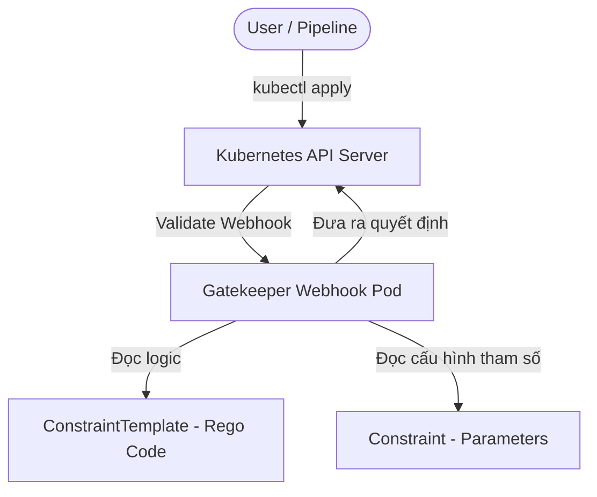

# OPA Gatekeeper: Quản lý Chính sách Bảo mật (Policy Enforcement)

## 1. Giới thiệu về Open Policy Agent (OPA) và Ngôn ngữ Rego

### 1.1. Open Policy Agent (OPA) là gì?
**Open Policy Agent (OPA)** là một công cụ mã nguồn mở, hoạt động độc lập (general-purpose policy engine) được CNCF tài trợ để thống nhất việc thực thi chính sách trên toàn bộ hệ thống phần mềm (như Microservices, Kubernetes, CI/CD pipelines, API gateways). OPA tách biệt phần logic kiểm tra chính sách (policy decision) ra khỏi mã nguồn nghiệp vụ của ứng dụng (policy enforcement).

### 1.2. Ngôn ngữ Rego
OPA sử dụng ngôn ngữ **Rego** để khai báo các chính sách. Rego là ngôn ngữ khai báo (declarative query language) cho phép viết các cấu trúc kiểm tra phức tạp dựa trên dữ liệu đầu vào dạng JSON/YAML.

Các khái niệm cơ bản trong Rego:
*   **Rules (Quy tắc):** Định nghĩa kết quả kiểm tra. Một quy tắc thường trả về giá trị boolean hoặc một tập hợp thông báo lỗi nếu có vi phạm.
    *   *Lưu ý:* Trong OPA thuần túy, quy tắc chặn thường được đặt tên là `deny[msg]`. Tuy nhiên, trong **OPA Gatekeeper** hoạt động trên Kubernetes, quy tắc bắt buộc phải có tên là `violation` và trả về một cấu trúc object dạng `violation[{"msg": msg}]` để webhook của Gatekeeper có thể nhận diện và chặn tài nguyên.
*   **Variables (Biến số):** Dùng để lưu trữ giá trị tạm thời hoặc duyệt qua cấu trúc dữ liệu.
*   **Expressions (Biểu thức):** Là các mệnh đề so sánh hoặc tính toán. Nếu biểu thức trả về `true`, OPA tiếp tục đánh giá biểu thức tiếp theo trong khối. Nếu một biểu thức thất bại (false/null), toàn bộ khối quy tắc đó sẽ dừng lại và coi như không khớp.
*   **Logical Operators (Toán tử logic):**
    *   **AND (Và):** Các biểu thức viết cách nhau bằng dòng mới hoặc dấu phẩy `,` trong cùng một khối quy tắc đại diện cho quan hệ AND. Tất cả phải đúng thì quy tắc mới được kích hoạt.
    *   **OR (Hoặc):** Được thể hiện bằng cách định nghĩa nhiều khối quy tắc có cùng tên. Chỉ cần một khối quy tắc đúng, quy tắc đó sẽ được coi là hợp lệ.

*Ví dụ đoạn code Rego đơn giản (OPA thuần túy sử dụng `deny`):*
```rego
package kubernetes.admission

# Chặn nếu container sử dụng image có nhãn "latest"
deny[msg] {
    # Duyệt qua các container trong Pod spec
    container := input.review.object.spec.containers[_]
    # Kiểm tra xem image có kết thúc bằng ":latest" hay không
    endswith(container.image, ":latest")
    # Định nghĩa thông báo lỗi trả về
    msg := sprintf("Image '%v' khong duoc phep su dung tag latest", [container.image])
}
```

*Ví dụ đoạn code trên khi viết cho OPA Gatekeeper (sử dụng `violation`):*
```rego
package kubernetes.admission

violation[{"msg": msg}] {
    container := input.review.object.spec.containers[_]
    endswith(container.image, ":latest")
    msg := sprintf("Image '%v' khong duoc phep su dung tag latest", [container.image])
}
```

---

## 2. Kiến trúc Gatekeeper và các CRD Core

**OPA Gatekeeper** là giải pháp tích hợp OPA vào Kubernetes dưới dạng một **Admission Controller**. Nó lắng nghe các sự kiện qua Validation Webhook để cho phép hoặc từ chối các yêu cầu tạo/sửa đổi tài nguyên.

Gatekeeper quản lý chính sách thông qua hai Custom Resource Definitions (CRDs) chính:



### 2.1. ConstraintTemplate
*   Là CRD khai báo **logic kiểm tra** viết bằng Rego.
*   Nó đóng vai trò như một "hàm" hoặc "lớp" (class), định nghĩa cấu trúc dữ liệu đầu vào mong muốn (schema của các tham số) và mã Rego để thực hiện việc validate.
*   ConstraintTemplate không trực tiếp chặn tài nguyên nào cả, nó chỉ định nghĩa *cách thức* chặn.

### 2.2. Constraint
*   Là CRD áp dụng logic được định nghĩa trong `ConstraintTemplate` vào các tài nguyên thực tế. Nó tương tự như một "thể hiện" (instance) của template.
*   Constraint cấu hình:
    *   **Tham số (Parameters):** Truyền các giá trị cụ thể vào template (ví dụ: danh sách các nhãn bắt buộc phải có).
    *   **Phạm vi áp dụng (Target/Match):** Chỉ định chính sách này áp dụng cho những Namespace nào, loại tài nguyên nào (Pods, Services, Namespaces...), hoặc loại trừ các Namespace hệ thống như `kube-system`.

---

## 3. Chế độ Kiểm tra: Audit vs Enforce (Deny)

Gatekeeper hỗ trợ hai chế độ vận hành chính cho các chính sách bảo mật:

### 3.1. Chế độ Enforce (Mặc định)
*   Khi có một yêu cầu tạo hoặc cập nhật tài nguyên vi phạm chính sách của Constraint, Gatekeeper Webhook sẽ phản hồi trực tiếp về API Server từ chối yêu cầu đó.
*   **Kết quả:** Người dùng hoặc công cụ CI/CD sẽ nhận lỗi ngay lập tức trên terminal (ví dụ: `Error from server (Forbidden): admission webhook "validation.gatekeeper.sh" denied the request...`).
*   **Khi nào dùng:** Áp dụng cho các chính sách nghiêm ngặt liên quan đến bảo mật và tuân thủ (compliance) đã qua kiểm thử kỹ lưỡng.

### 3.2. Chế độ Audit
*   Thay vì chặn việc tạo tài nguyên, Gatekeeper cho phép tài nguyên vi phạm được tạo bình thường, nhưng sẽ quét định kỳ toàn bộ Cluster để phát hiện và liệt kê các tài nguyên không tuân thủ vào trường `status` của tài nguyên `Constraint` tương ứng.
*   Để cấu hình chế độ này, ta đặt thuộc tính `spec.enforcementAction: dryrun` trong Constraint.
*   **Kết quả:** Giúp quản trị viên kiểm tra mức độ ảnh hưởng của một chính sách mới đối với các tài nguyên đang chạy trước khi kích hoạt chặn hoàn toàn.
*   **Khi nào dùng:** Khi triển khai các chính sách mới vào một Cluster đã chạy ổn định từ trước.

---

## 4. Ví dụ cấu hình YAML Manifest

Kịch bản dưới đây yêu cầu tất cả các Namespace phải chứa một nhãn (label) được cấu hình trước. Nếu thiếu, yêu cầu tạo tài nguyên sẽ bị chặn.

### 4.1. Khai báo ConstraintTemplate (`constrainttemplate.yaml`)
Template này định nghĩa một quy tắc kiểm tra xem nhãn được truyền từ tham số `labels` có tồn tại trong metadata của tài nguyên hay không.

```yaml
apiVersion: templates.gatekeeper.sh/v1
kind: ConstraintTemplate
metadata:
  name: k8srequiredlabels
spec:
  crd:
    spec:
      names:
        kind: K8sRequiredLabels
      validation:
        openAPIV3Schema:
          type: object
          properties:
            labels:
              type: array
              items:
                type: string
  targets:
    - target: admission.k8s.gatekeeper.sh
      rego: |
        package k8srequiredlabels

        # Quy tắc violation bắt buộc dùng trong Gatekeeper để trả về lỗi
        violation[{"msg": msg}] {
          provided := {label | input.review.object.metadata.labels[label]}
          required := {label | label := input.parameters.labels[_]}
          missing  := required - provided
          count(missing) > 0
          msg := sprintf("Tai nguyen thieu cac nhan (labels) bat buoc sau: %v", [missing])
        }
```

### 4.2. Khai báo Constraint (`constraint.yaml`)
Constraint dưới đây sử dụng mẫu `K8sRequiredLabels` ở trên để bắt buộc tất cả các `Namespace` khi tạo mới phải có nhãn `owner`.

```yaml
apiVersion: constraints.gatekeeper.sh/v1beta1
kind: K8sRequiredLabels
metadata:
  name: ns-must-have-owner
spec:
  match:
    kinds:
      - apiGroups: [""]
        kinds: ["Namespace"]
  parameters:
    labels: ["owner"]
```

### 4.3. Thử nghiệm thực tế

1.  **Trường hợp vi phạm:** Tạo một namespace không có label `owner`:
    ```yaml
    apiVersion: v1
    kind: Namespace
    metadata:
      name: test-qa
    ```
    *Kết quả chạy lệnh:*
    ```bash
    kubectl apply -f namespace-test.yaml
    ```
    *Lỗi trả về:*
    ```text
    Error from server (Forbidden): error when creating "namespace-test.yaml": admission webhook "validation.gatekeeper.sh" denied the request: [ns-must-have-owner] Tai nguyen thieu cac nhan (labels) bat buoc sau: {"owner"}
    ```

2.  **Trường hợp thành công:** Thêm nhãn `owner: platform-team` vào namespace:
    ```yaml
    apiVersion: v1
    kind: Namespace
    metadata:
      name: test-qa
      labels:
        owner: platform-team
    ```
    *Kết quả chạy lệnh:*
    ```bash
    kubectl apply -f namespace-test.yaml
    # Output: namespace/test-qa created
    ```
