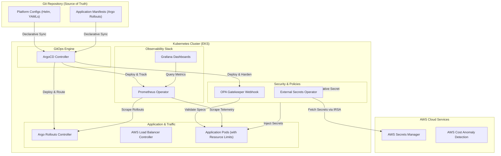

# Tích Hợp Hệ Thống Nền Tảng (Platform Integration) & Phân Hoạch Tài Nguyên (Resource Partitioning)

## 1. Kiến trúc Tích hợp Hệ thống Nền tảng Toàn diện (Cohesive Platform Architecture)

Trong các ngày học trước của tuần 8, 9 và 10, chúng ta đã lần lượt nghiên cứu các thành phần riêng lẻ của hạ tầng đám mây:
*   **Delivery (Tuần 8):** GitOps (ArgoCD) và Canary Deployment (Argo Rollouts).
*   **Observability (Tuần 9):** Hệ thống giám sát (Prometheus, Grafana, Prometheus-Operator).
*   **Security & Policy (Tuần 10):** Quản lý Secrets (External Secrets Operator - ESO + AWS Secrets Manager) và thực thi chính sách bảo mật (OPA Gatekeeper / ValidatingAdmissionPolicy).

Mục tiêu tối thượng của **Platform Engineering** là tích hợp toàn bộ các thành phần phân mảnh này thành một nền tảng thống nhất (**Unified Platform**), có khả năng tự động hóa cao và vận hành an toàn.

### 1.1. Sơ đồ Kiến trúc Tích hợp
Dưới đây là mô hình hoạt động của một nền tảng tích hợp đầy đủ, nơi GitOps quản lý toàn bộ vòng đời của cả ứng dụng và các cấu phần hệ thống:



### 1.2. Mục tiêu Bootstrap Nền tảng trong vòng 2 giờ
Một tiêu chuẩn đo lường mức độ trưởng thành của Platform Engineering là khả năng dựng mới hoàn toàn một cluster sạch (**bootstrap a fresh cluster**) và đưa toàn bộ platform vào trạng thái hoạt động (bảo mật, sẵn sàng deploy, có monitor) trong **dưới 2 giờ**.

Để đạt được mục tiêu này, ta áp dụng mô hình thiết kế **Application of Applications (App-of-Apps)** của ArgoCD:
1.  **Giai đoạn 1: Khởi tạo Hạ tầng Cơ bản (Infra Bootstrapping - 30 phút)**
    *   Sử dụng Terraform để khởi tạo EKS Cluster, VPC, Subnets, IAM Roles, Node Groups và cài đặt các add-ons cơ bản ở mức AWS (như VPC CNI, CoreDNS, Kube-proxy).
2.  **Giai đoạn 2: Khởi chạy GitOps Engine (10 phút)**
    *   Cài đặt ArgoCD bằng Helm hoặc Kustomize thông qua lệnh CLI tối giản.
    *   Liên kết ArgoCD với Repository quản trị hệ thống.
3.  **Giai đoạn 3: Triển khai Root Application (App-of-Apps - 15 phút)**
    *   Khai báo một Application gốc trong ArgoCD có tên `root-platform`. Root Application này trỏ tới thư mục chứa danh sách các Application con đại diện cho các thành phần nền tảng:
        *   `eso-app` (External Secrets Operator)
        *   `gatekeeper-app` (OPA Gatekeeper)
        *   `prometheus-stack-app` (Prometheus & Grafana)
        *   `argo-rollouts-app` (Argo Rollouts)
        *   `ingress-controller-app` (AWS Load Balancer Controller)
    *   ArgoCD sẽ tự động phân tích đồ thị phụ thuộc và tuần tự triển khai toàn bộ các thành phần này lên cluster.
4.  **Giai đoạn 4: Đồng bộ Cấu hình Bảo mật và Bí mật (Secrets & Policy - 20 phút)**
    *   External Secrets Operator tự động kết nối với AWS Secrets Manager bằng IAM Roles for Service Accounts (IRSA) để kéo các API Key, database credentials về cluster mà không cần cấu hình thủ công.
    *   Gatekeeper áp dụng các `Constraint` bảo mật mặc định (ví dụ: cấm dùng image tag `latest`, bắt buộc cấu hình resource limits).
5.  **Giai đoạn 5: Kiểm tra và Bàn giao (15 phút)**
    *   Kiểm tra tính năng Canary deployment bằng cách deploy ứng dụng mẫu qua Argo Rollouts.
    *   Truy cập Grafana Dashboard để xác nhận các metrics hệ thống và ứng dụng đang được scrape thành công.

---

## 2. Quản lý và Phân hoạch Tài nguyên (Resource Partitioning & Enforcement)

Trong môi trường chia sẻ tài nguyên (Multi-tenancy), việc phân hoạch tài nguyên là bắt buộc để tránh tình trạng một ứng dụng sử dụng tài nguyên quá mức làm ảnh hưởng đến các ứng dụng khác trên cùng một Node (lỗi **Noisy Neighbor**) hoặc làm cạn kiệt tài nguyên của toàn bộ Cluster.

Kubernetes cung cấp hai công cụ mạnh mẽ để quản lý vấn đề này ở cấp độ Namespace: **ResourceQuota** và **LimitRange**.

```
                           +----------------------------------------+
                           | Namespace: production                  |
                           |                                        |
                           |  +----------------------------------+  |
                           |  | ResourceQuota (Hạn mức Namespace) |  |
                           |  | - Tổng CPU Requests <= 4 Cores   |  |
                           |  | - Tổng Memory Requests <= 8Gi    |  |
                           |  | - Số Pods tối đa <= 10           |  |
                           |  +-----------------+----------------+  |
                           |                    |                   |
                           |                    v                   |
                           |  +----------------------------------+  |
                           |  | LimitRange (Quy chuẩn Pod/Cont)  |  |
                           |  | - CPU Request mặc định: 200m     |  |
                           |  | - CPU Limit mặc định: 500m       |  |
                           |  | - CPU Min/Max: 100m / 1000m      |  |
                           |  +-----------------+----------------+  |
                           |                    |                   |
                           |       +------------+------------+      |
                           |       |                         |      |
                           |       v                         v      |
                           |  +----------+              +----------+  |
                           |  | Pod A    |              | Pod B    |  |
                           |  | (Tự Set) |              | (Mặc định|  |
                           |  | Req: 300m|              | được set |  |
                           |  | Lim: 600m|              | Req: 200m|  |
                           |  +----------+              | Lim: 500m|  |
                           |                            +----------+  |
                           +----------------------------------------+
```

### 2.1. ResourceQuota (Hạn mức Namespace)
**ResourceQuota** định nghĩa tổng giới hạn tiêu thụ tài nguyên của tất cả các Pod chạy trong một Namespace cụ thể.

*   **Phạm vi áp dụng:** Cấp Namespace.
*   **Các loại tài nguyên có thể giới hạn:**
    *   **Compute Resources:** Tổng dung lượng CPU/Memory mà các Pod có thể yêu cầu (`requests.cpu`, `requests.memory`) hoặc giới hạn tối đa (`limits.cpu`, `limits.memory`).
    *   **Object Count:** Giới hạn tổng số lượng đối tượng Kubernetes được phép tạo ra, chẳng hạn như số lượng Pods (`pods`), Services (`services`), PersistentVolumeClaims (`persistentvolumeclaims`), ConfigMaps, Secrets, v.v.
    *   **Storage Resources:** Tổng dung lượng lưu trữ yêu cầu trên các StorageClass (`requests.storage`).
*   **Cơ chế hoạt động:** Khi một ResourceQuota được áp dụng vào một Namespace, API Server sẽ kiểm tra mọi yêu cầu tạo mới hoặc chỉnh sửa Pod. Nếu yêu cầu đó khiến tổng mức sử dụng tài nguyên của Namespace vượt quá hạn mức đã khai báo, Kubernetes API Server sẽ chặn yêu cầu và trả về thông báo lỗi `403 Forbidden`.

### 2.2. LimitRange (Quy chuẩn tài nguyên cấp Container)
Trong khi ResourceQuota kiểm soát tổng tài nguyên của Namespace, **LimitRange** quản lý cấu hình tài nguyên ở cấp độ từng Pod và Container riêng lẻ bên trong Namespace đó.

*   **Phạm vi áp dụng:** Cấp Container và Pod trong một Namespace.
*   **Các chức năng chính:**
    *   **Default Request & Limit:** Thiết lập thông số CPU/Memory mặc định cho các Container nếu nhà phát triển không định nghĩa chúng trong file manifest của ứng dụng. Điều này đảm bảo không có Pod nào chạy mà không có giới hạn tài nguyên.
    *   **Minimum & Maximum limits:** Định nghĩa ngưỡng tối thiểu (Min) và tối đa (Max) cho tài nguyên CPU và Memory mà một Container có thể khai báo. Nếu Container khai báo vượt quá Max hoặc thấp hơn Min, Pod sẽ bị từ chối khởi tạo.
    *   **Limit-to-Request Ratio:** Thiết lập tỷ lệ tối đa giữa Limit và Request của một tài nguyên (ví dụ: giới hạn bộ nhớ limit không được phép gấp quá 2 lần request) nhằm kiểm soát mức độ Overcommit tài nguyên trên Node.

---

## 3. Cấu hình YAML Manifests Thực tế

Dưới đây là các manifest hoàn chỉnh, sẵn sàng triển khai trên môi trường thật để thực thi phân hoạch tài nguyên cho Namespace `staging`.

### 3.1. Cấu hình ResourceQuota (`resource-quota.yaml`)
Manifest này giới hạn tổng lượng tài nguyên của Namespace `staging` nhằm đảm bảo môi trường kiểm thử không tiêu tốn quá nhiều tài nguyên của Cluster:
*   Tổng số CPU Request tối đa: 4 Cores.
*   Tổng dung lượng Memory Request tối đa: 8Gi.
*   Tổng số CPU Limit tối đa: 6 Cores.
*   Tổng dung lượng Memory Limit tối đa: 12Gi.
*   Số lượng Pod tối đa được chạy đồng thời: 10 Pods.
*   Số lượng Service tối đa: 5 Services.

```yaml
apiVersion: v1
kind: ResourceQuota
metadata:
  name: staging-resource-quota
  namespace: staging
spec:
  hard:
    # Giới hạn tổng dung lượng CPU được Request từ tất cả các Pod
    requests.cpu: "4"
    # Giới hạn tổng dung lượng Memory được Request từ tất cả các Pod
    requests.memory: 8Gi
    # Giới hạn tổng dung lượng CPU tối đa (Limit) được thiết lập
    limits.cpu: "6"
    # Giới hạn tổng dung lượng Memory tối đa (Limit) được thiết lập
    limits.memory: 12Gi
    # Giới hạn số lượng Pod được phép chạy đồng thời trong namespace
    pods: "10"
    # Giới hạn số lượng Service được tạo ra
    services: "5"
    # Giới hạn số lượng PersistentVolumeClaims được tạo ra
    persistentvolumeclaims: "4"
```

### 3.2. Cấu hình LimitRange (`limit-range.yaml`)
Manifest này quy định hành vi mặc định và các giới hạn kiểm soát cho các Container được triển khai trong Namespace `staging`. Nó bổ sung cho ResourceQuota bằng cách tự động điền thông số tài nguyên nếu Pod thiếu khai báo:

```yaml
apiVersion: v1
kind: LimitRange
metadata:
  name: staging-limit-range
  namespace: staging
spec:
  limits:
  - type: Container
    # Thiết lập giá trị mặc định cho Limits nếu Container không khai báo
    default:
      cpu: 500m      # Tương đương 0.5 Core
      memory: 512Mi
    # Thiết lập giá trị mặc định cho Requests nếu Container không khai báo
    defaultRequest:
      cpu: 200m      # Tương đương 0.2 Core
      memory: 256Mi
    # Ngưỡng tối đa một Container có thể khai báo
    max:
      cpu: "2"       # Tương đương 2 Cores
      memory: 2Gi
    # Ngưỡng tối thiểu một Container bắt buộc phải khai báo
    min:
      cpu: 100m      # Tương đương 0.1 Core
      memory: 128Mi
```

### 3.3. Hướng dẫn Triển khai và Kiểm tra

1.  **Tạo Namespace `staging` (nếu chưa có):**
    ```bash
    kubectl create namespace staging
    ```

2.  **Áp dụng cấu hình LimitRange và ResourceQuota:**
    ```bash
    kubectl apply -f limit-range.yaml
    kubectl apply -f resource-quota.yaml
    ```

3.  **Kiểm tra trạng thái áp dụng hạn mức:**
    ```bash
    kubectl describe quota staging-resource-quota -n staging
    ```
    *Đầu ra của lệnh này sẽ hiển thị danh sách các tài nguyên đã cấu hình, mức giới hạn (Hard Limit) và lượng tài nguyên hiện tại đang được sử dụng (Used).*

4.  **Thử nghiệm cơ chế hoạt động:**
    *   **Thử nghiệm 1 (Tự động bổ sung):** Tạo một Pod đơn giản không khai báo `resources` trong Spec. Sau khi tạo thành công, dùng lệnh `kubectl get pod <pod_name> -n staging -o yaml` để xác minh xem Pod đó có tự động được gán thông số Request/Limit từ `LimitRange` hay không.
    *   **Thử nghiệm 2 (Chặn vi phạm):** Cố tình tạo một Pod yêu cầu `requests.cpu: "5"` (vượt quá 4 Cores của ResourceQuota) hoặc gán `limits.cpu: "3"` (vượt quá 2 Cores tối đa của LimitRange). Hệ thống sẽ chặn ngay lập tức và trả về lỗi thông báo chi tiết lý do từ chối.
