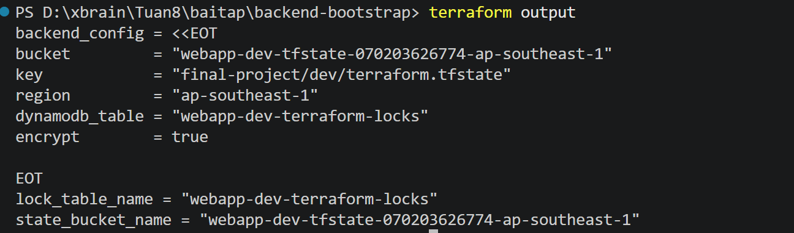
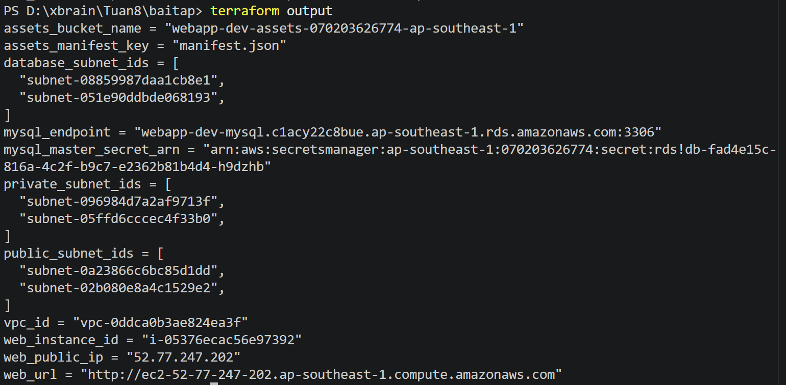
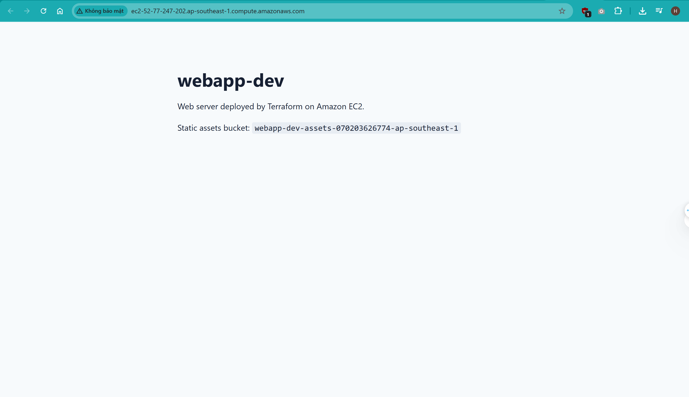
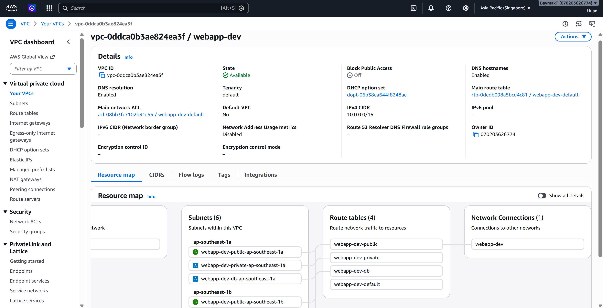
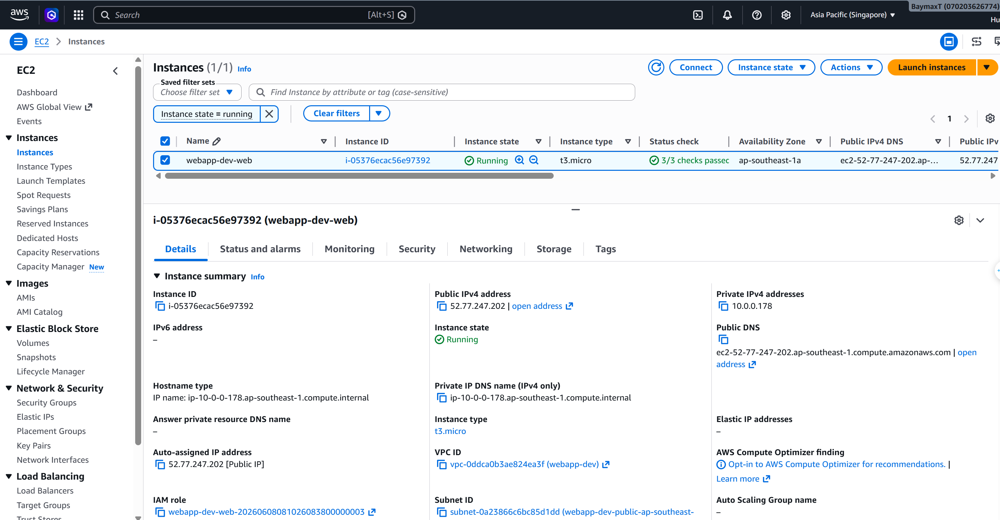
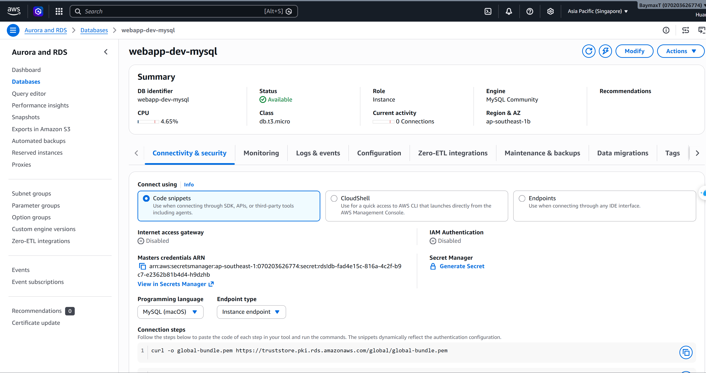
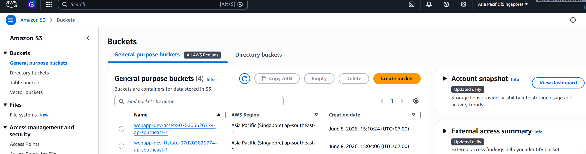
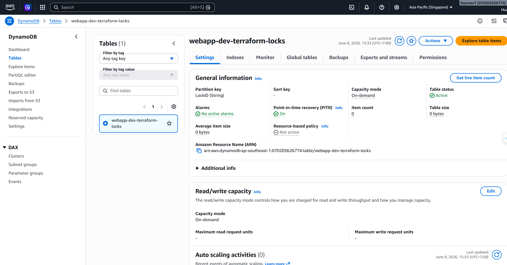
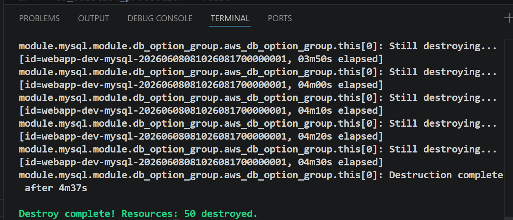

# Final Project: Deploy Web App on AWS bằng Terraform

## Kiến Trúc

Hạ tầng được tạo gồm:

- VPC với public subnets, private subnets và database subnets
- EC2 web server nằm trong public subnet
- RDS MySQL nằm trong database subnet, không public internet
- S3 bucket private dùng cho static assets
- Security Groups chỉ mở traffic cần thiết
- Terraform state lưu trên S3 backend, có DynamoDB locking

Luồng truy cập:

```text
User
  |
  | HTTP/80
  v
EC2 Web Server - public subnet
  |
  | MySQL/3306
  v
RDS MySQL - database subnet

EC2 Web Server
  |
  | IAM Role
  v
S3 Static Assets Bucket
```

## Cấu Trúc Thư Mục

```text
.
|-- backend-bootstrap/        # Tạo S3 bucket lưu state và DynamoDB lock table
|-- modules/                  # Các Terraform modules đã clone sẵn
|-- main.tf                   # Gọi modules VPC, EC2, RDS, S3
|-- security-groups.tf        # Security Groups và rules
|-- iam.tf                    # IAM policy cho EC2 đọc S3
|-- variables.tf              # Biến đầu vào
|-- outputs.tf                # Output sau khi apply
|-- backend.hcl.example       # Mẫu config backend
|-- terraform.tfvars.example  # Mẫu biến môi trường
`-- README.md
```

## Bước 1: Tạo Remote Backend

Terraform cần backend trước để lưu state trên S3 và lock bằng DynamoDB.

```powershell
cd D:\xbrain\Tuan8\baitap\backend-bootstrap
Copy-Item terraform.tfvars.example terraform.tfvars
terraform init
terraform validate
terraform plan
terraform apply
```

Khi Terraform hỏi xác nhận, nhập:

```text
yes
```

Sau khi apply xong, tạo file `backend.hcl` cho stack chính:

```powershell
terraform output -raw backend_config | Set-Content -Path ..\backend.hcl -Encoding utf8
```

## Bước 2: Deploy Stack Chính

Quay về thư mục gốc:

```powershell
cd D:\xbrain\Tuan8\baitap
Copy-Item terraform.tfvars.example terraform.tfvars
```

Kiểm tra file `terraform.tfvars`, các giá trị chính nên là:

```hcl
aws_region   = "ap-southeast-1"
project_name = "webapp"
environment  = "dev"

http_ingress_cidr_blocks = ["0.0.0.0/0"]
ssh_ingress_cidr_blocks  = []

db_instance_class = "db.t3.micro"
db_multi_az       = false
```

Deploy hạ tầng:

```powershell
terraform init -backend-config backend.hcl
terraform fmt -recursive
terraform validate
terraform plan
terraform apply
```

Khi Terraform hỏi xác nhận, nhập:

```text
yes
```

## Bước 3: Kiểm Tra Kết Quả

Xem output:

```powershell
terraform output
```

Các output quan trọng:

- `web_url`: URL truy cập web server
- `web_public_ip`: public IP của EC2
- `mysql_endpoint`: endpoint private của RDS MySQL
- `assets_bucket_name`: tên S3 bucket static assets
- `mysql_master_secret_arn`: ARN secret chứa mật khẩu RDS trong AWS Secrets Manager

Mở trình duyệt và truy cập giá trị `web_url`.

## Evidence Cần Chụp

Dùng `Win + Shift + S` để chụp màn hình trên Windows.

Nên chụp các ảnh sau để làm evidence:

1. Terminal sau khi chạy backend bootstrap thành công:


2. Terminal sau khi stack chính apply thành công:


3. Trình duyệt truy cập web server:


4. AWS Console - VPC: 


5. AWS Console - EC2:


6. AWS Console - RDS:


7. AWS Console - S3:


8. AWS Console - DynamoDB:


9. Terminal sau khi destroy thành công:


## Security Đã Áp Dụng

- Không lưu mật khẩu database trong `.tfvars`
- RDS password do AWS Secrets Manager quản lý
- RDS không public internet
- Database SG chỉ nhận traffic từ Web SG
- SSH đóng mặc định
- EC2 dùng IAM role thay vì access key hard-code
- S3 bucket block public access
- S3 bật versioning và server-side encryption
- Terraform state lưu trên S3, có DynamoDB lock
- Security Group rules viết bằng resource riêng

## Destroy Sau Khi Hoàn Thành

Mặc định RDS đang bật deletion protection. Trước khi destroy, sửa file `terraform.tfvars` ở thư mục gốc:

```hcl
db_deletion_protection = false
db_skip_final_snapshot = true
```

Apply thay đổi:

```powershell
cd D:\xbrain\Tuan8\baitap
terraform apply
```

Sau đó destroy stack chính:

```powershell
terraform destroy
```

Khi stack chính đã destroy xong, nếu muốn xóa cả backend:

```powershell
cd D:\xbrain\Tuan8\baitap\backend-bootstrap
notepad terraform.tfvars
```

Bật biến sau để Terraform được phép xóa mọi object và version trong S3 state bucket:

```hcl
state_bucket_force_destroy = true
```

Sau đó chạy:

```powershell
terraform destroy
```

Chỉ destroy backend sau khi stack chính đã xóa xong, vì backend đang giữ Terraform state.

## Xử Lý Lỗi BucketNotEmpty Khi Destroy Backend

Nếu destroy backend bị lỗi:

```text
BucketNotEmpty: The bucket you tried to delete is not empty. You must delete all versions in the bucket.
```

Nguyên nhân là S3 backend bucket có bật versioning và vẫn còn các version của file state.

Chạy lệnh sau để cập nhật state của bucket sang `force_destroy = true`:

```powershell
cd D:\xbrain\Tuan8\baitap\backend-bootstrap
terraform apply -target='module.state_bucket.aws_s3_bucket.this[0]'
```

Khi Terraform hỏi xác nhận, nhập:

```text
yes
```

Kiểm tra lại:

```powershell
terraform state show 'module.state_bucket.aws_s3_bucket.this[0]'
```

Đảm bảo thấy:

```text
force_destroy = true
```

Sau đó destroy lại:

```powershell
terraform destroy
```