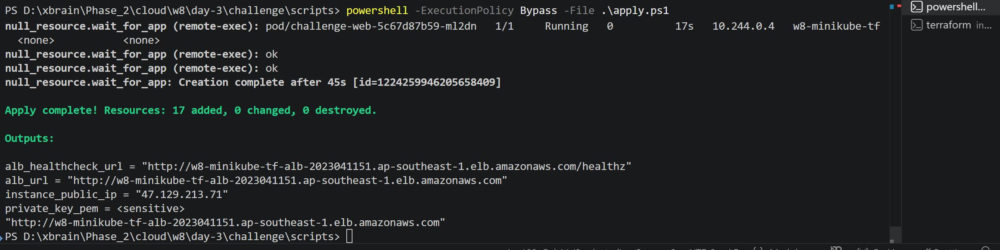
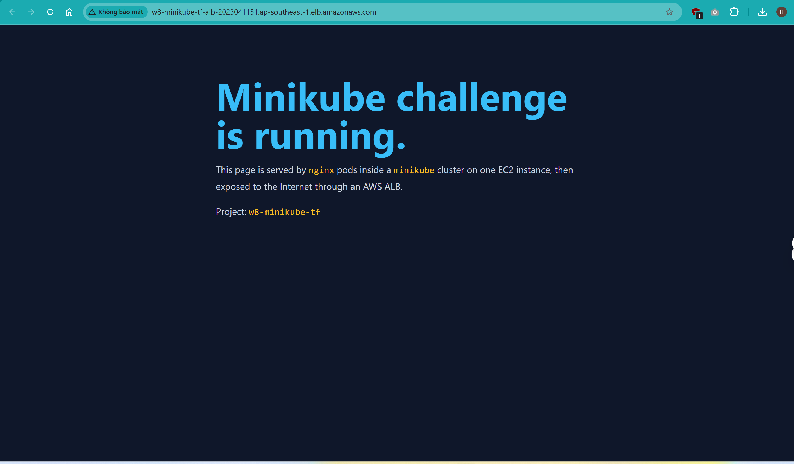
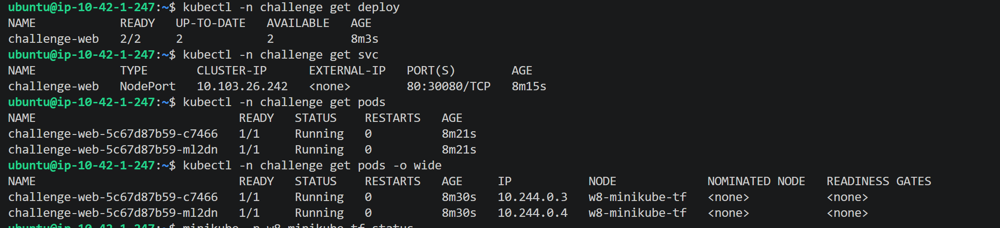
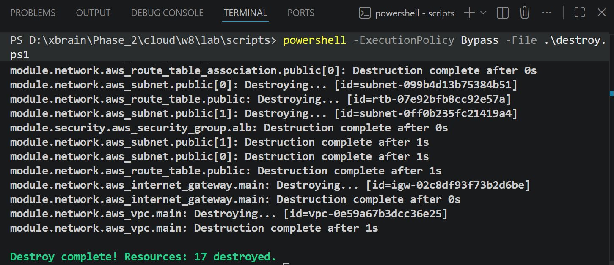

# W8 Challenge - Minikube trên AWS bằng Terraform

## Mục tiêu

Bài này giải phần 08 challenge bằng Terraform:

- Dựng 1 EC2 instance trên AWS.
- Chạy Kubernetes trên EC2 bằng `minikube`.
- App chạy bên trong Kubernetes, không cài trực tiếp lên EC2.
- App truy cập được từ Internet thông qua AWS ALB.
- Một lệnh tạo toàn bộ hạ tầng và app.
- Terraform dùng ít nhất 2 provider trong cùng project.
- Có thể `terraform destroy` để dọn sạch tài nguyên sau khi nộp bài.

## Cấu trúc project

```text
lab/
  README.md
  .gitignore
  docs/
    architecture.md
  scripts/
    apply.ps1
    destroy.ps1
    apply.sh
    destroy.sh
  infra/
    versions.tf
    providers.tf
    variables.tf
    data.tf
    locals.tf
    main.tf
    wait.tf
    outputs.tf
    environments/
      dev.tfvars.example
    k8s/
      app.yaml.tftpl
    templates/
      cloud-init.yaml.tftpl
    modules/
      network/
      security/
      ec2-minikube/
      alb/
```

Ý nghĩa các thư mục chính:

- `scripts/`: chứa lệnh chạy nhanh `apply` và `destroy`.
- `infra/`: Terraform root, nơi chạy `terraform init/apply/destroy`.
- `infra/modules/`: các module Terraform tách theo trách nhiệm.
- `infra/k8s/`: manifest Kubernetes cho app demo.
- `infra/templates/`: cloud-init dùng để bootstrap EC2.
- `docs/`: giải thích kiến trúc và luồng request.

## Kiến trúc

```text
Internet
   |
   v
AWS ALB :80
   |
   v
Target Group -> EC2:30080
                 |
                 v
              socat forward trên EC2
                 |
                 v
              minikube IP:30080
                 |
                 v
              K8s Service NodePort
                 |
                 v
              nginx Deployment, 2 pods
```

## Cách chạy một lệnh

Trước khi chạy, máy cần có AWS credentials. Có thể cấu hình bằng `aws configure` hoặc biến môi trường như `AWS_ACCESS_KEY_ID` và `AWS_SECRET_ACCESS_KEY`.

Chạy từ repo root trên Windows PowerShell:

```powershell
powershell -ExecutionPolicy Bypass -File .\cloud\w8\lab\scripts\apply.ps1
```

Chạy từ repo root trên Linux/macOS:

```bash
bash cloud/w8/lab/scripts/apply.sh
```

Sau khi apply xong, lấy URL public của ALB:

```bash
cd cloud/w8/lab/infra
terraform output alb_url
```

## Terraform dùng provider nào

Project này dùng 4 provider:

- `aws`: tạo VPC, subnet, EC2, security group, ALB, target group và listener.
- `cloudinit`: render file `templates/cloud-init.yaml.tftpl` thành `user_data` cho EC2.
- `tls`: tạo SSH key pair cho EC2.
- `null`: chạy bước kiểm tra từ xa sau khi EC2 và ALB được tạo.

Cách các provider được wire với nhau:

- Output của `cloudinit` trở thành `user_data` cho module EC2.
- Output của `tls` trở thành AWS key pair và private key dùng cho remote verification.
- `null_resource.wait_for_app` dùng output từ AWS và private key từ `tls` để kiểm tra app local và health check qua ALB.

## Cách debug

Chỉ lấy private key khi cần debug:

```bash
cd cloud/w8/lab/infra
terraform output -raw private_key_pem > challenge.pem
chmod 600 challenge.pem
ssh -i challenge.pem ubuntu@$(terraform output -raw instance_public_ip)
```

Các lệnh kiểm tra hữu ích trên EC2:

```bash
kubectl -n challenge get deploy,svc,pods -o wide
minikube -p w8-minikube-tf status
systemctl status minikube-nodeport-forward.service
curl http://127.0.0.1:30080/healthz
sudo tail -n 100 /var/log/k8s-challenge-bootstrap.log
```

## Destroy tài nguyên

Windows PowerShell:

```powershell
powershell -ExecutionPolicy Bypass -File .\cloud\w8\lab\scripts\destroy.ps1
```

Linux/macOS:

```bash
bash cloud/w8/lab/scripts/destroy.sh
```

## Bằng chứng nộp bài

- Output của `terraform output alb_url`.

- Ảnh browser mở được app qua URL ALB.

- Output của `kubectl -n challenge get deploy,svc,pods -o wide`.

- Destroy.

