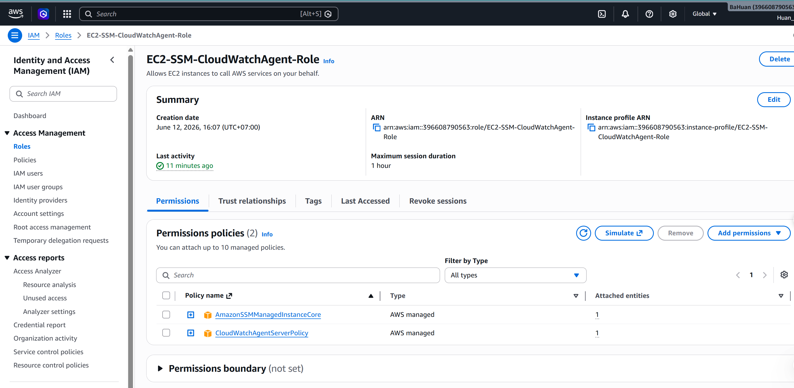
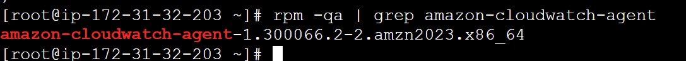
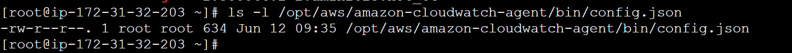
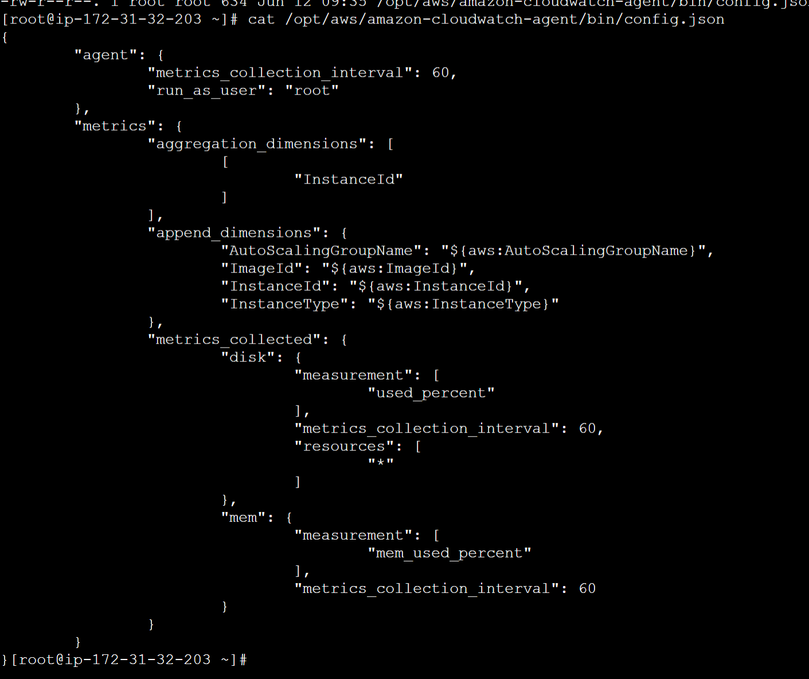
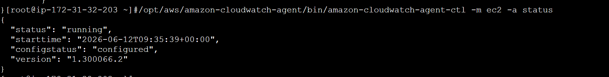

# Evidence - Installing the CloudWatch Agent on EC2 using SSM

## 1. IAM role cua EC2



## 2. CloudWatch Agent da duoc cai dat



## 3. Wizard da tao config




## 4. Verify and check status



## 10. Cac lenh chinh da su dung

Cai CloudWatch Agent tren Amazon Linux:

```bash
sudo yum install amazon-cloudwatch-agent -y
```

Neu dung Amazon Linux 2023 va can `dnf`:

```bash
sudo dnf install amazon-cloudwatch-agent -y
```

Chay wizard:

```bash
sudo /opt/aws/amazon-cloudwatch-agent/bin/amazon-cloudwatch-agent-config-wizard
```

Start agent:

```bash
sudo /opt/aws/amazon-cloudwatch-agent/bin/amazon-cloudwatch-agent-ctl -a fetch-config -m ec2 -s -c file:/opt/aws/amazon-cloudwatch-agent/bin/config.json
```

Verify and check status:

```bash
sudo /opt/aws/amazon-cloudwatch-agent/bin/amazon-cloudwatch-agent-ctl -m ec2 -a status
```

## 11. Ket luan

CloudWatch Agent da duoc cai dat, cau hinh va start thanh cong tren EC2. EC2 duoc truy cap bang AWS Systems Manager Session Manager thay vi SSH key. Ket qua verify/check status cho thay CloudWatch Agent dang o trang thai `running`.
