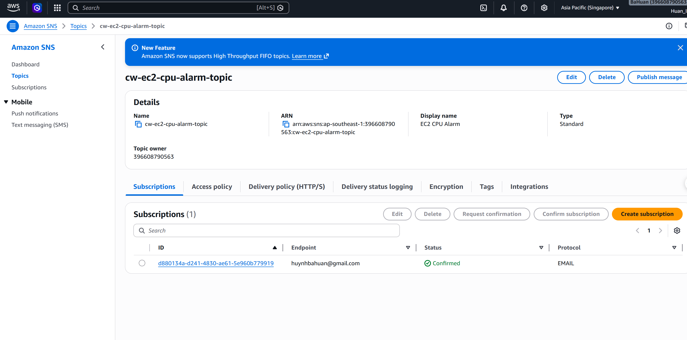
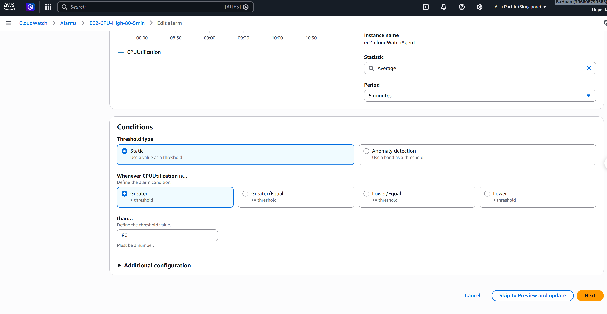
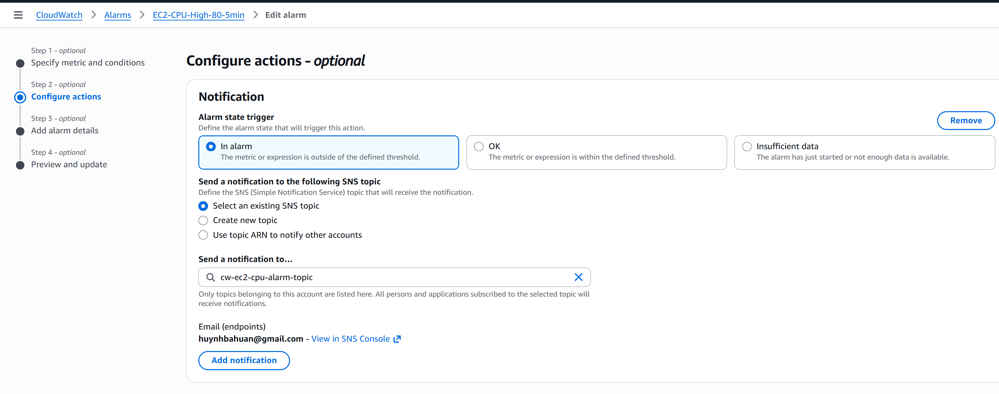
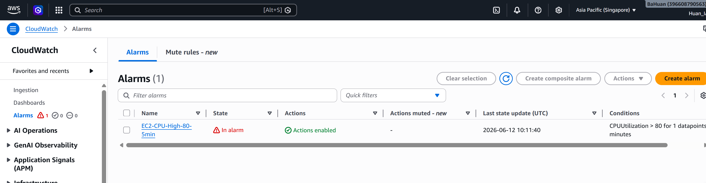
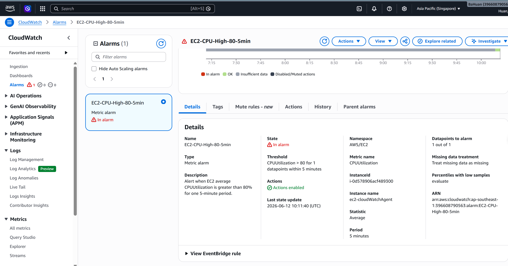
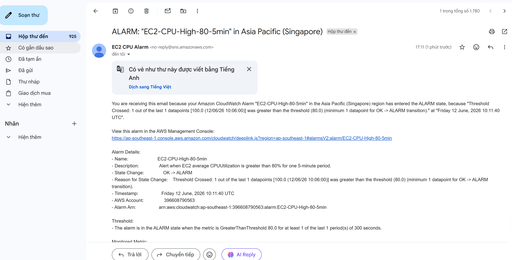

# Evidence - CPU Alarm gửi Email Alert qua SNS

## 1. SNS Topic đã được tạo và mail subscription đã được xác nhận



## 2. Chọn metric CPUUtilization của EC2


## 3. Cấu hình điều kiện CloudWatch Alarm



## 4. Gắn SNS notification action



## 5. CloudWatch Alarm đã được tạo



## 6. Test alarm bằng CPU load thật

Lệnh đã dùng trên EC2 Linux để tạo CPU load:

```bash
N=$(nproc)
PIDS=""
for i in $(seq 1 $N); do
  yes > /dev/null &
  PIDS="$PIDS $!"
done

echo "Dang tao CPU load voi PID:$PIDS"
sleep 420
kill $PIDS
```



## 7. Email cảnh báo CloudWatch đã nhận được




## 8. Các lệnh chính đã sử dụng

Tạo CPU load trên EC2:

```bash
N=$(nproc)
PIDS=""
for i in $(seq 1 $N); do
  yes > /dev/null &
  PIDS="$PIDS $!"
done
sleep 420
kill $PIDS
```

Test alarm bằng AWS CLI:

```bash
aws cloudwatch set-alarm-state \
  --alarm-name "EC2-CPU-High-80-5min" \
  --state-value ALARM \
  --state-reason "Lab test: force ALARM state to verify SNS email notification"
```

Reset alarm bằng AWS CLI:

```bash
aws cloudwatch set-alarm-state \
  --alarm-name "EC2-CPU-High-80-5min" \
  --state-value OK \
  --state-reason "Lab test: reset alarm state after email verification"
```

## 9. Kết luận

Bài lab đã cấu hình thành công CloudWatch Alarm theo dõi `CPUUtilization` của EC2. Khi CPU vượt ngưỡng `80%` theo chu kỳ đánh giá đã cấu hình, alarm chuyển sang trạng thái `ALARM` và gửi notification đến SNS topic `cw-ec2-cpu-alarm-topic`. Email subscription đã được xác nhận nên người nhận nhận được email cảnh báo từ `AWS Notifications`.

Kết quả chứng minh bài lab hoàn thành:

- SNS topic đã được tạo.
- Email subscription ở trạng thái `Confirmed`.
- CloudWatch Alarm đã gắn đúng metric `CPUUtilization`.
- Điều kiện alarm là CPU > `80%`.
- Alarm action gửi về SNS topic.
- Email cảnh báo đã được nhận thành công.
