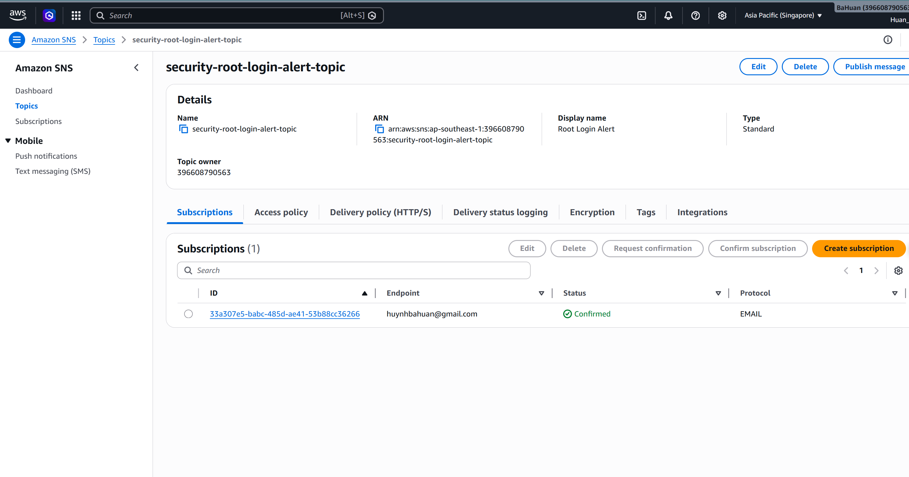
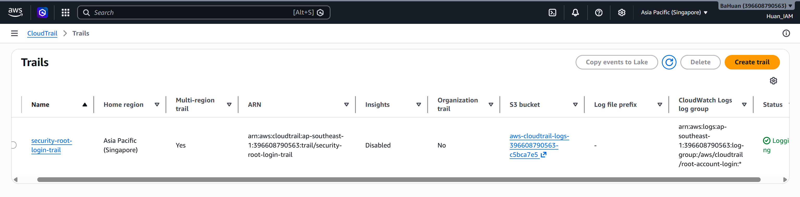
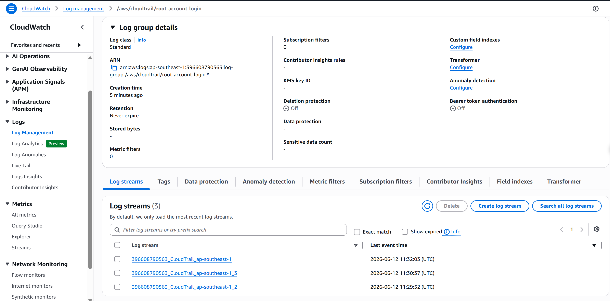
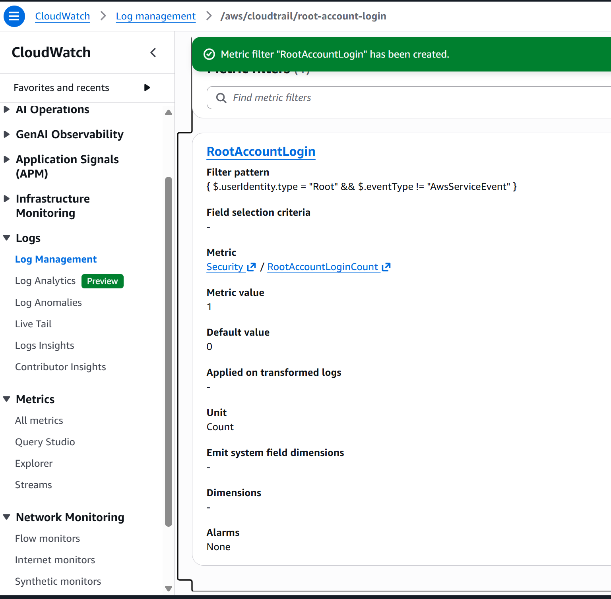
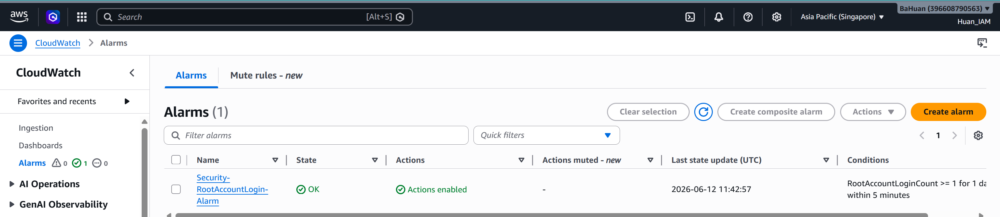
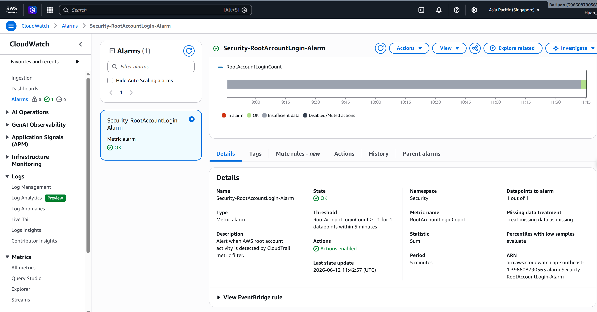
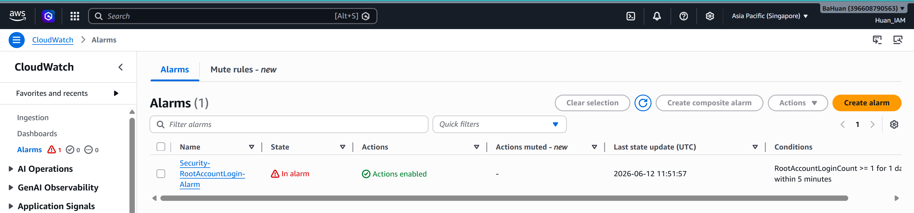
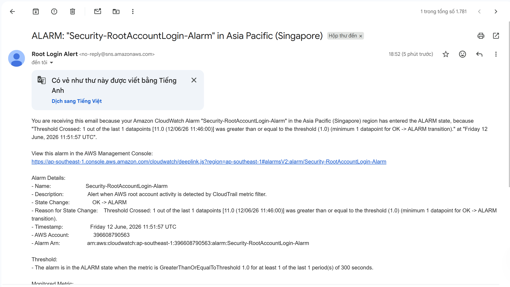
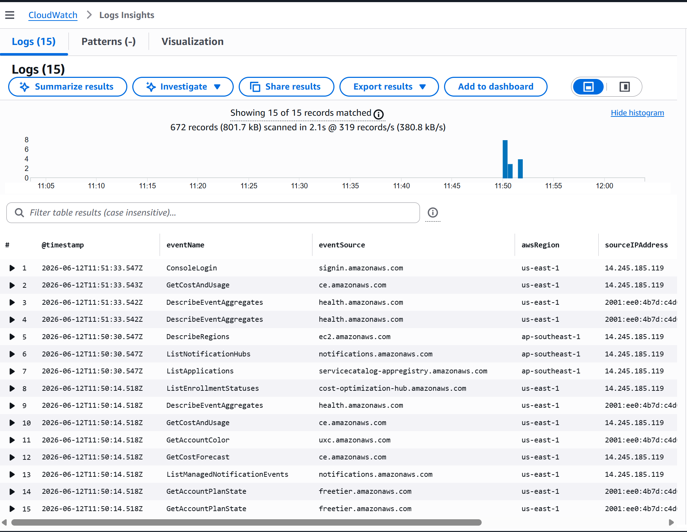

# Evidence - Alert on AWS Root Account Login

## 1. SNS topic đã được tạo và Email subscription đã được xác nhận



## 2. CloudTrail trail đã được tạo và đang logging



## 3. CloudTrail gửi logs sang CloudWatch Logs



## 4. Custom metric đã xuất hiện trong CloudWatch



## 5. CloudWatch Alarm đã được tạo




## 6. Test Alarm



## 7. Email cảnh báo đã nhận được



## 8. Kiểm tra root event bằng CloudWatch Logs Insights

Query đã dùng:

```sql
fields @timestamp, eventName, eventSource, awsRegion, sourceIPAddress, userIdentity.type, eventType
| filter userIdentity.type = "Root"
| sort @timestamp desc
| limit 20
```


## 9. Các lệnh chính đã sử dụng

Test metric an toàn:

```bash
aws cloudwatch put-metric-data \
  --namespace Security \
  --metric-name RootAccountLoginCount \
  --value 1 \
  --unit Count
```

Ép alarm sang `ALARM` để test notification:

```bash
aws cloudwatch set-alarm-state \
  --alarm-name "Security-RootAccountLogin-Alarm" \
  --state-value ALARM \
  --state-reason "Lab test: force ALARM state to verify SNS notification"
```

Reset alarm về `OK`:

```bash
aws cloudwatch set-alarm-state \
  --alarm-name "Security-RootAccountLogin-Alarm" \
  --state-value OK \
  --state-reason "Lab test: reset alarm after notification verification"
```

CloudWatch Logs Insights:

```sql
fields @timestamp, eventName, eventSource, awsRegion, sourceIPAddress, userIdentity.type, eventType
| filter userIdentity.type = "Root"
| sort @timestamp desc
| limit 20
```

## 10. Kết luận

Bài lab đã cấu hình thành công cơ chế cảnh báo root account activity trên AWS. CloudTrail ghi nhận management events và gửi logs sang CloudWatch Logs. Metric filter `RootAccountLogin` phát hiện event có `userIdentity.type = Root` và tạo metric `Security/RootAccountLoginCount`. CloudWatch Alarm `Security-RootAccountLogin-Alarm` được cấu hình để chuyển sang `ALARM` khi metric lớn hơn hoặc bằng `1` trong chu kỳ 5 phút, sau đó gửi cảnh báo qua SNS đến email đã xác nhận.

Kết quả chứng minh bài lab hoàn thành:

- CloudTrail trail đang logging.
- CloudWatch Logs nhận được CloudTrail events.
- Metric filter root account đã được tạo.
- Custom metric `RootAccountLoginCount` đã có.
- CloudWatch Alarm đã được tạo với threshold `>= 1`.
- SNS email notification hoạt động.
- Email cảnh báo đã được nhận thành công.
